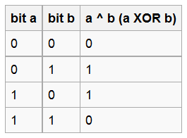

#ATmega128 Timers with interrupts in C

Set up tick like this (This is with a prescaler of 64, duh):

    #define tick F_osc/64

OCR1A - Used like:  

    TIMSK = (1 << OCIE1A)

To send an interrupt when timer 1 matches the value of OCR1A (Set to the tick you want).   
The interrupt vector for this is 

    ISR(TIMER1_COMPA_vect)

 Use it as a function doing code that will happen when the compare matches.

If TCCR1B was initialized with (1 << WGM12), the timer will be reset when the comparison matches.  
Initialize TCCR1B with prescaler and reset on match like this (example):

    TCCR1B = (1 << CS10) | (1 << CS11) | (1 << WGM12)

Timer prescaler is set with CS10, CS11 and CS12 like this:

Set value of timer like this (set to zero before using):

    TCNT1 = 0x0;

For other timers, replace 1 with the corresponding timer you want to use.

#Bitwise operations in C

###The AND (&) operator  

###The OR (|) operator

\newpage

###The NOT (~) operator

###The XOR (^) operator

#Bit-shifting

Using << (left-shift) will shift the current bits to the left.  
Like this: 0b00001010 $\to$ 0b00010100 

\>> will do the opposite.  
Like this: 0b00010100 $\to$ 0b00001010 